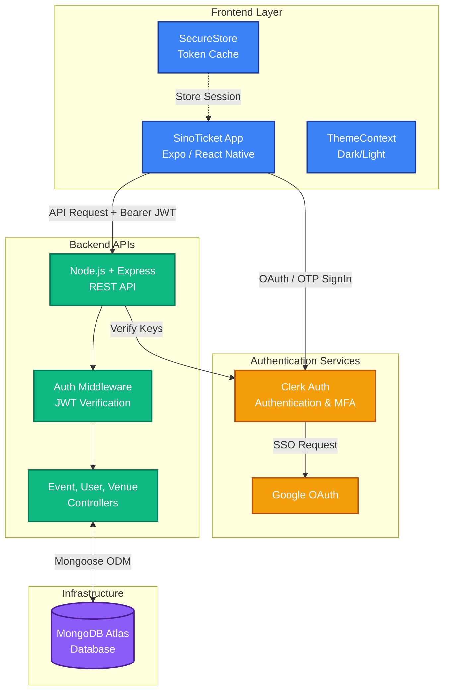
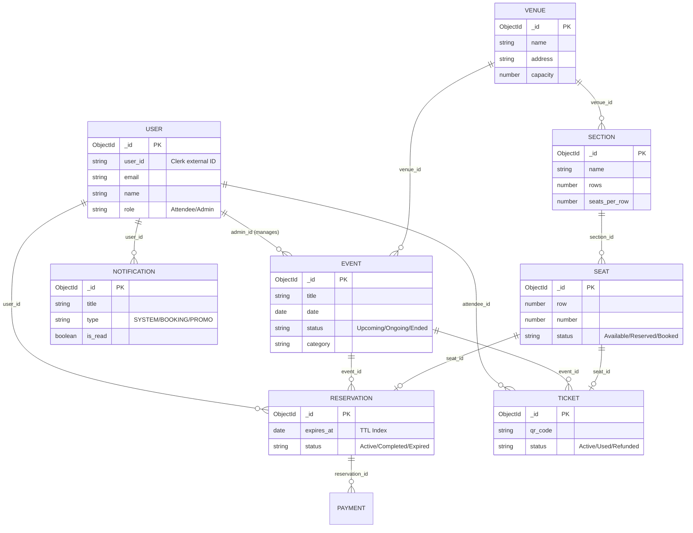
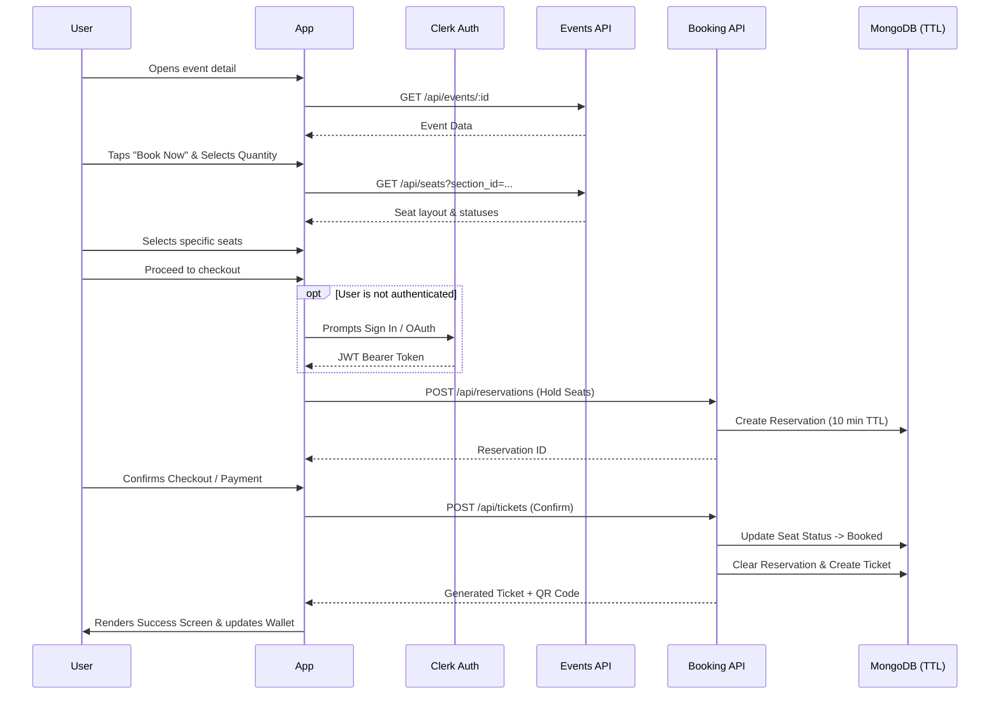

# SinoTicket — Architecture & Implementation Guide

> **Version:** 1.0 | **Stack:** Expo SDK 54 · Node.js/Express · MongoDB · Clerk  
> **Last updated:** April 2026

---

## Table of Contents

1. [Project Overview](#1-project-overview)
2. [Repository Structure](#2-repository-structure)
3. [Technology Stack](#3-technology-stack)
4. [Frontend Architecture](#4-frontend-architecture)
   - 4.1 [Expo Router Navigation](#41-expo-router-navigation)
   - 4.2 [Authentication Flow](#42-authentication-flow)
   - 4.3 [Theme System](#43-theme-system)
   - 4.4 [Data Fetching Layer](#44-data-fetching-layer)
   - 4.5 [Screen Reference](#45-screen-reference)
   - 4.6 [Component Library](#46-component-library)
   - 4.7 [Native Tab Bar](#47-native-tab-bar)
5. [Backend Architecture](#5-backend-architecture)
   - 5.1 [Server Entry Point](#51-server-entry-point)
   - 5.2 [Data Models](#52-data-models)
   - 5.3 [API Routes](#53-api-routes)
   - 5.4 [Authentication Middleware](#54-authentication-middleware)
6. [Booking Flow (End-to-End)](#6-booking-flow-end-to-end)
7. [Environment Variables](#7-environment-variables)
8. [Skills & Agent Setup](#8-skills--agent-setup)
9. [Known Patterns & Conventions](#9-known-patterns--conventions)

---

## 1. Project Overview

**SinoTicket** is a cross-platform mobile ticketing application targeting events in Chad (and beyond). It lets users:

- Browse and search upcoming events by title, date, and category
- View event details with rich media, description, and venue info
- Select ticket categories and specific seats
- Checkout and receive a digital ticket with a QR code
- Manage their ticket wallet directly in the app

The system is split into two codebases inside a single monorepo:

| Layer | Directory | Tech |
|---|---|---|
| Mobile App | `/` (root) | Expo / React Native |
| REST API | `/backend` | Node.js / Express / MongoDB |
| Admin Dashboard | `/admin-dashboard` | (Separate app) |

### System Architecture



---

## 2. Repository Structure

```
SinoTicket/
├── app/                        # Expo Router file-based routing
│   ├── _layout.tsx             # Root layout (Clerk + ThemeProvider + fonts)
│   ├── index.tsx               # Entry redirect
│   ├── oauth-native-callback.tsx
│   ├── (auth)/                 # Unauthenticated screens
│   │   ├── _layout.tsx
│   │   ├── welcome.tsx
│   │   ├── onboarding.tsx
│   │   ├── sign-in.tsx
│   │   ├── sign-up.tsx
│   │   ├── sign-up-phone.tsx
│   │   └── forgot-password.tsx
│   └── (root)/                 # Authenticated screens
│       ├── _layout.tsx
│       ├── checkout.tsx
│       ├── seat-selection.tsx
│       ├── success.tsx
│       ├── notifications.tsx   # In-app notifications inbox
│       ├── event/[id].tsx      # Dynamic event detail page
│       └── (tabs)/             # Bottom tab bar screens
│           ├── _layout.tsx     # NativeTabs definition
│           ├── home.tsx
│           ├── ticket.tsx
│           ├── history.tsx
│           └── profile.tsx
├── components/                 # Shared UI components
│   ├── Booking/                # Booking-specific components
│   │   ├── QuantitySelector.tsx
│   │   ├── SummaryBar.tsx
│   │   └── TicketCategoryCard.tsx
│   ├── CustomButton.tsx
│   ├── InputField.tsx
│   ├── LoadingScreen.tsx
│   └── PromoCarousel.tsx
├── constants/
│   └── colors.ts               # Centralized theme color tokens
├── context/
│   └── ThemeContext.tsx        # ThemeProvider + useTheme hook
├── hooks/
│   ├── useSocialAuth.ts        # Google OAuth via Clerk
│   └── useWarmUpBrowser.ts    # Expo WebBrowser pre-warming
├── lib/
│   ├── auth.ts                 # Clerk token cache (SecureStore)
│   └── fetch.ts                # fetchAPI + useFetch + useAuthFetch
├── backend/
│   ├── index.js                # Express server entry point
│   ├── config/db.js            # MongoDB connection
│   ├── models/                 # Mongoose schemas
│   ├── routes/                 # Express route definitions
│   ├── controllers/            # Route handler logic
│   ├── middleware/auth.js      # JWT verification middleware
│   ├── swagger/                # Swagger/OpenAPI setup
│   └── scripts/                # DB seed scripts
└── .agents/skills/             # AI agent skill files (Expo skills)
```

---

## 3. Technology Stack

### Frontend
| Package | Version | Purpose |
|---|---|---|
| `expo` | ~54.0 | Cross-platform runtime |
| `expo-router` | ~6.0 | File-based navigation |
| `expo-blur` | ~15.0 | Glassmorphism BlurView |
| `expo-linear-gradient` | latest | Image gradient overlays |
| `expo-auth-session` | ~7.0 | OAuth redirect handling |
| `@clerk/expo` | ^3.1 | Authentication provider |
| `react-native-reanimated` | ~4.1 | Animations and transitions |
| `react-native-safe-area-context` | ~5.6 | Safe area insets |
| `nativewind` / `tailwindcss` | 4.x / 3.x | Utility CSS classes |
| `@expo/vector-icons` | ^15 | Ionicons, MaterialIcons |
| `expo-secure-store` | ~15.0 | Persistent secure storage |
| `expo-image-picker` | ~16.0 | Device photo library access |

### Backend
| Package | Version | Purpose |
|---|---|---|
| `express` | ^4 | REST API framework |
| `mongoose` | ^8 | MongoDB ODM |
| `@clerk/express` | ^2 | Authentication validation |
| `dotenv` | ^16 | Environment variables |
| `cors` | ^2 | Cross-origin policy |
| `swagger-jsdoc` / `swagger-ui-express` | — | API documentation |

---

## 4. Frontend Architecture

### 4.1 Expo Router Navigation

The app uses **file-based routing** via Expo Router. The navigation tree:

```
/                      → index.tsx (redirects based on auth)
/(auth)/...            → Sign-in, Sign-up, Onboarding, Forgot PW
/(root)/(tabs)/home    → Home feed
/(root)/(tabs)/ticket  → My Wallet
/(root)/(tabs)/history → History
/(root)/(tabs)/profile → Profile
/(root)/personal-info  → Manage personal profile + avatar
/(root)/event/[id]     → Event detail (dynamic)
/(root)/seat-selection → Seat picker
/(root)/checkout       → Checkout
/(root)/success        → Booking confirmation
```

**Root layout (`app/_layout.tsx`)** wraps everything in:
```
ThemeProvider
  └── ClerkProvider (+ tokenCache using SecureStore)
        └── ClerkLoaded
              └── AppShell (Stack navigator + StatusBar)
```

### 4.2 Authentication Flow

Authentication uses **Clerk** with the `@clerk/expo` SDK.

**Sign-up:** Email + password → email verification OTP → backend user creation  
**Sign-in:** Email/password or Google OAuth → session set via `setActive()`  
**MFA:** If the account requires second-factor, the app sends an email code and verifies it

**Google OAuth** is handled via `useSocialAuth` hook:
```ts
const handleGoogleAuth = async () => {
  await useOAuth({ strategy: 'oauth_google' }).startOAuthFlow(...)
}
```

Sessions are cached with `expo-secure-store` via `lib/auth.ts`:
```ts
export const tokenCache = {
  getToken: (key) => SecureStore.getItemAsync(key),
  saveToken: (key, value) => SecureStore.setItemAsync(key, value),
}
```

After successful auth, users are navigated to `/(root)/(tabs)/home`.

### 4.3 Theme System

The app has a full **dark/light mode** system persisted across launches.

**`constants/colors.ts`** — Central color palette:

| Token | Light | Dark | Usage |
|---|---|---|---|
| `background` | `#FFFFFF` | `#0F172A` | Screen backgrounds |
| `card` | `#F8FAFC` | `#1E293B` | Cards, modals |
| `text` | `#0F172A` | `#F1F5F9` | Primary text |
| `subtext` | `#64748B` | `#94A3B8` | Secondary text |
| `primary` | `#0286FF` | `#0286FF` | CTA buttons, icons |
| `primaryLight` | `rgba(2,134,255,0.10)` | `rgba(2,134,255,0.18)` | Soft tinted backgrounds |
| `seatAvailable` | `#E2E8F0` | `#334155` | Seat map |
| `seatSelected` | `#0286FF` | `#0286FF` | Selected seat |
| `seatBooked` | `#EF4444` | `#DC2626` | Taken seat |

**`context/ThemeContext.tsx`** — React context providing `colors`, `theme`, `isDark`, and `toggleTheme()`.

The theme is **persisted** via `SecureStore` under the key `sinoticket_theme`. On first load, it defaults to the OS appearance via `useColorScheme()`.

Usage in any component:
```ts
const { colors, isDark } = useTheme();
```

### 4.4 Data Fetching Layer

**`lib/fetch.ts`** provides three utilities:

| Export | Description |
|---|---|
| `fetchAPI(url, options?)` | Raw fetch wrapper — reads `EXPO_PUBLIC_API_URL` as base URL, handles non-JSON errors |
| `useAuthFetch()` hook | Returns `authFetch` that automatically attaches the Clerk JWT Bearer token |
| `useFetch<T>(url, authenticated?)` hook | State-managed fetcher with `{ data, loading, error, refetch }` |

Example usage (public endpoint):
```ts
const { data, loading, error } = useFetch<any>('/api/events?limit=20', false);
```

Example usage (authenticated endpoint):
```ts
const { authFetch } = useAuthFetch();
const result = await authFetch('/api/tickets/me');
```

**Search debouncing** is done at the component level on the Home screen with a 500ms timeout.

### 4.5 Screen Reference

#### Home (`/(tabs)/home.tsx`)
- Fetches events from `/api/events` with `search`, `category`, pagination params
- Shows promo carousel (`PromoCarousel`) for "All" category with no search
- **Featured events**: top 3 as horizontal snap scroll cards (260x320, full bleed image)
- **More Events**: remaining events as vertical list rows with image thumbnail and metadata

#### Event Detail (`/(root)/event/[id].tsx`)
- **Hero Section**: full-width image, `LinearGradient` fade into theme background color
- **Back + Share** buttons: circular `BlurView` glassmorphic overlays at top
- **Date Badge**: `BlurView` card overlaid on image bottom-right
- **Info Row**: Shows start time. Inline **Tickets Pricing** block displays immediately below.
- **Description** + **Location** map placeholder image
- **Floating CTA**: absolute bottom bar with `LinearGradient` + green "Book Now" pill
- Tap "Book Now" → bottom-sheet modal for ticket category + quantity selection, then → `seat-selection`

#### Ticket Wallet (`/(tabs)/ticket.tsx`)
- Fetches tickets from `/api/tickets/me` (authenticated)
- Renders a `FlatList` of `TicketItem` components
- Each ticket is expandable to reveal a custom pixel-art **QR code** display (hex-based pattern)
- Pull-to-refresh supported

#### Notifications (`/(root)/notifications.tsx`)
- Accessed via the bell icon in the `AppHeader` (which polls for unread count badge)
- Fetches notifications from `/api/notifications` using `useAuthFetch`
- Visually separates read vs. unread alerts using subtle glass-morphic backgrounds
- Optimistic UI updates for "Mark as Read" and "Mark All as Read"

#### Seat Selection (`/(root)/seat-selection.tsx`)
- Receives params: `event_id`, `section_id`, `category_id`, `event_title`, `category_name`, initial `quantity` and `price`
- Displays a visual seat map grid fetched from `/api/seats`
- Supports dynamic selection of up to 10 seats on the map, overriding the initial `quantity` param
- Available / Selected / Reserved / Booked states with color coding from `colors` tokens
- Proceeds to `/checkout`

#### Checkout (`/(root)/checkout.tsx`)
- Displays order summary
- Calls `/api/reservations` to hold seats temporarily (TTL-backed)
- Calls `/api/tickets` to confirm booking and generate QR code
- On success → `/success` screen

#### Personal Information (`/(root)/personal-info.tsx`)
- Manages user's name, phone number, and avatar image
- Uploads images via `expo-image-picker` with base64 data URIs
- Saves via `PUT /api/users/me` and ensures changes apply across `AppHeader` and `Profile` instantly using optimized data fetch caching.

### 4.6 Component Library

| Component | Location | Purpose |
|---|---|---|
| `InputField` | `components/InputField.tsx` | Styled text input with icon and label |
| `CustomButton` | `components/CustomButton.tsx` | Themed pressable button with loading state |
| `PromoCarousel` | `components/PromoCarousel.tsx` | Auto-scrolling banner carousel on Home |
| `LoadingScreen` | `components/LoadingScreen.tsx` | Full-screen loading indicator |
| `TicketCategoryCard` | `components/Booking/TicketCategoryCard.tsx` | Selectable ticket tier card in modal |
| `QuantitySelector` | `components/Booking/QuantitySelector.tsx` | Increment/decrement quantity row |
| `SummaryBar` | `components/Booking/SummaryBar.tsx` | Sticky bottom bar with price + CTA button |

### 4.7 Native Tab Bar

The tab bar uses **`expo-router/unstable-native-tabs`** (`NativeTabs`) — a platform-native implementation:
- **iOS**: uses `UITabBar` with SF Symbols
- **Android**: uses Material Design bottom navigation with `MaterialIcons` via `VectorIcon`

```tsx
import { NativeTabs, Icon, Label, VectorIcon } from 'expo-router/unstable-native-tabs';
import { MaterialIcons } from '@expo/vector-icons';

<NativeTabs>
  <NativeTabs.Trigger name="home">
    <Icon sf="house" androidSrc={<VectorIcon family={MaterialIcons} name="home" />} />
    <Label>Home</Label>
  </NativeTabs.Trigger>
  // ... ticket, history, profile
</NativeTabs>
```

> Note: `Icon` and `Label` are imported directly from `expo-router/unstable-native-tabs`, NOT as properties of `NativeTabs.Trigger`. The `md="..."` prop is not supported; use `androidSrc` with `VectorIcon` instead.

---

## 5. Backend Architecture

### 5.1 Server Entry Point

**`backend/index.js`** — Express server listening on `0.0.0.0:PORT` (default `5000`):
- Connects to MongoDB via `config/db.js`
- Registers all route namespaces
- Mounts **Swagger UI** at `/api-docs`
- Global error handler formats errors as `{ success: false, error: "..." }`

### 5.2 Data Models

All models live in `backend/models/` and use **Mongoose schemas**. Below is the Entity Relationship Diagram showing how these documents interconnect:



#### User
```js
{ user_id, email, name, profile_photo, phone_number,
  role: ['Attendee','Admin'], preferences, is_verified, last_login }
```
> `user_id` maps to Clerk's external user ID.

#### Event
```js
{ title, description, imageUrl, date, venue_id (->Venue),
  admin_id (->User), status: ['Upcoming','Ongoing','Ended'],
  category: ['Music','Sports','Cultural','Business','Fashion'],
  artist_lineup: [{ name, time }],
  ticket_categories: [{ category_id, name, price, section_id, quantity, sold }] }
```

#### Venue
```js
{ name, address, city, capacity }
```

#### Section
```js
{ venue_id (->Venue), name, rows, seats_per_row }
```

#### Seat
```js
{ section_id (->Section), row, number, status: ['Available','Reserved','Booked'] }
```

#### Reservation *(TTL-indexed)*
```js
{ user_id, event_id, seat_id, expires_at, status: ['Active','Expired','Completed'] }
```
> Uses a MongoDB TTL index (`expireAfterSeconds: 0`) so expired reservations are auto-deleted.

#### Ticket
```js
{ event_id, category_id, attendee_id, seat_id, qr_code, status: ['Active','Used','Refunded'] }
```

#### Payment
```js
{ reservation_id, amount, method, status }
```

#### Notification
```js
{ user_id, title, message, type: ['SYSTEM','BOOKING','PROMO'], is_read, link }
```

### 5.3 API Routes

| Method | Route | Auth | Description |
|---|---|---|---|
| `GET` | `/api/events` | Public | List/search events (supports `?search=`, `?category=`, `?limit=`, `?page=`) |
| `GET` | `/api/events/:id` | Public | Single event details (populates `venue_id`) |
| `POST` | `/api/events/add` | Admin | Create event |
| `PUT` | `/api/events/:id` | Admin | Update event |
| `DELETE` | `/api/events/:id` | Admin | Delete event |
| `GET` | `/api/users` | Auth | List users |
| `POST` | `/api/users` | Public | Create/sync user from Clerk |
| `GET` | `/api/venue` | Public | List venues |
| `POST` | `/api/venue` | Admin | Create venue |
| `GET` | `/api/sections` | Public | List sections |
| `GET` | `/api/seats` | Public | List seats (filter by section) |
| `POST` | `/api/reservations` | Auth | Hold a seat |
| `GET` | `/api/tickets/me` | Auth | Current user's tickets |
| `POST` | `/api/tickets` | Auth | Confirm booking / issue ticket |
| `GET` | `/api/notifications` | Auth | List user notifications |
| `PUT` | `/api/notifications/:id/read` | Auth | Mark notification as read |
| `PUT` | `/api/notifications/read-all` | Auth | Mark all notifications as read |

> Full Swagger documentation available at `http://<backend-host>/api-docs`

### 5.4 Authentication Middleware

`backend/middleware/auth.js` verifies the **Clerk JWT** from the `Authorization: Bearer <token>` header on protected routes. It decodes the token and attaches the user to `req.user` for downstream handlers.

---

## 6. Booking Flow (End-to-End)

The complete end-to-end booking flow integrates frontend UI navigation and backend temporal seat holding (TTL).




---

## 7. Environment Variables

### Frontend (`/.env`)
```env
EXPO_PUBLIC_CLERK_PUBLISHABLE_KEY=pk_test_...
EXPO_PUBLIC_API_URL=http://192.168.x.x:5001
```

### Backend (`/backend/.env`)
```env
PORT=5001
MONGO_URI=mongodb+srv://...
CLERK_SECRET_KEY=sk_test_...
```

> **Note:** `EXPO_PUBLIC_API_URL` must be the **LAN IP** of your dev machine (not `localhost`) when testing on a physical device.

---

## 8. Skills & Agent Setup

The project uses **Expo AI Agent Skills** installed via `npx skills add expo/skills`. All 10 official skills from `https://github.com/expo/skills.git` are installed to `.agents/skills/`:

| Skill | Purpose |
|---|---|
| `building-native-ui` | Complete guide for building Expo Router UIs |
| `expo-api-routes` | API route patterns for EAS Hosting |
| `expo-cicd-workflows` | EAS CI/CD workflow YAML files |
| `expo-deployment` | iOS / Android / Web deployment |
| `expo-dev-client` | Distribution and dev build setup |
| `expo-module` | Writing native Expo modules (Swift/Kotlin) |
| `expo-tailwind-setup` | NativeWind v5 / Tailwind CSS v4 setup |
| `native-data-fetching` | React Query, SWR, fetch patterns |
| `upgrading-expo` | SDK upgrade guide |
| `use-dom` | Expo DOM components (web in native) |

---

## 9. Known Patterns & Conventions

### Styling
- **Expo screens**: inline style objects — no separate StyleSheet file unless complex
- **Auth screens**: mix of NativeWind (`className=`) and inline styles for dynamic theming
- **Colors**: always referenced via `const { colors } = useTheme()` — never hardcoded
- **Typography**: primary font is `Syne_700Bold` loaded via `@expo-google-fonts/syne`

### Navigation
- Use `useRouter()` from `expo-router` for programmatic navigation
- Pass complex params via `router.push({ pathname, params })`
- Deep link paths use the file-system path convention e.g. `/(root)/event/[id]`

### API Calls
- Public data: `useFetch('/api/...', false)`
- User-specific data: `useAuthFetch()` then `authFetch('/api/...')`
- The base URL is always read from `EXPO_PUBLIC_API_URL` — never hardcoded

### Error Handling
- The backend always returns `{ success: true, ... }` or `{ success: false, error: "..." }`
- Frontend checks `data?.success` before reading payload fields
- `fetchAPI` throws descriptive errors for non-JSON or non-OK responses

### Glassmorphism Pattern (Event Detail)
```tsx
<BlurView
  intensity={isDark ? 50 : 80}
  tint={isDark ? "dark" : "light"}
  style={{ borderRadius: 24, overflow: 'hidden' }}
>
  {/* content */}
</BlurView>
```
- `intensity` adapts to dark/light — higher in light mode for visible frosting effect
- Always set `overflow: 'hidden'` on `BlurView` to clip border radius correctly
- For the LinearGradient hero fade: use `isDark ? 'rgba(0,0,0,0.8)' : 'rgba(255,255,255,0.9)'` as the middle stop so it blends naturally into the theme background in both modes

---

*This document is auto-generated and maintained alongside the codebase. Update it when adding new screens, models, or architectural changes.*
